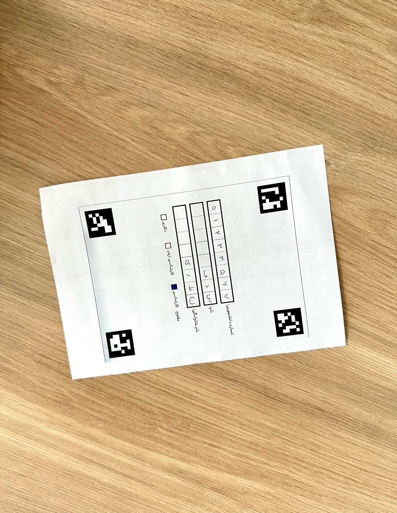

# Persian_handwriting_recognition
This projects is inspired by the final projcet of the course <a href="https://wp.kntu.ac.ir/nasihatkon/teaching/cvug/s2020/">Foundations of Computer Vision Course</a>. It contains procedures for data collection, preprocessing, annotation, training, and prediction and uses computer vision and machine learning techniques.

## Introduction

The goal of this project is to first, extract student's id, first name and last name from a handwritten form, and then classify each letter and number with a neural network model that has been trained based on a collected dataset from Persian handwritten letters and numbers. The dataset is collected by students in the course, and it has been preprocessed and annotated.

The form should be similar to Figure 1. As illustrated, the form in the picture can be in any orientation.

<figure style="text-align:center">
    
    <figcaption>Figure 1 - A sample of the test form.</figcaption>
</figure>

The output should be similar to the text below:

Form: test_sample.jpg <br>
Student ID: 01234567 <br>
First name: ص د ف<br>
Last name: ن ظ ر ی<br>

## Setup

<ol>
<li>Having `Ubuntu 20.04` or higher (recommended) </li>
<li>Having Minimum 10 GB RAM for training </li>
<li>Having `conda` installed and ready to be used</li>
<li>Setting up an environment:

```bash
conda create --name phr python==3.8.0
```

</li>
<li>Activating the environment:

```bash
conda activate phr
```

</li>
<li>Installing the dependencies

```bash
pip install -r requirements.txt
```
</li>
</ol>


## Data collection
The original dataset is taken from the one that is collected by students in the course, which can be found <a href='https://wp.kntu.ac.ir/nasihatkon/teaching/cvug/s2020/assets/files/project/Persian-digits-and-letter-raw.zip'>in the official website of the course</a>. However, in this repository, some modifications are applied to the dataset and some images that were not collected according to the instructions were removed. We recommend to use this dataset can be found in <a href="https://drive.google.com/drive/folders/1lZi71TKveuhSgGXpxAAWeNFkZHkU9SKB?usp=sharing">this link</a> as `data/01_raw.zip`. It should be unzipped and put in `data/01_raw` directory.

The dataset contains a set of images, taken from forms that can be found in `assets/dataset_form_a5.pdf`. Each form contains 4 Aruco markers and a number of cells which should be filled with persian handwritten numbers and letters. These forms have 2 types that have the following order:
  Type 'a': number '0', '1', the first part of the persian alphabet, '2', and '3'.
  Type 'b': number '4', '5', the second part of the persian alphabet, '6', '7, '8', and'9'.

In case of a need to collect a new dataset, or add more data to the current dataset, the following instructions must be followed:
  1. Form should be printed, prefrably in A5 size.
  2. The orientation of the arucos should be the same as a sample shown in `assets/dataset_sample1.jpg`.
  3. Each row is dedicated to either a number or a letter.
  4. Each row should be filled with the determined order of the specific type of form. It should be either the same as `assets/dataset_sample1.jpg` (type a) or `assets/dataset_sample2.jpg` (type b).
  5. Image should be taken in format 'jpg'. While the orientation of the arucos should be fixed, the form it self can be in custome distance and orientation with respect to the camera.
  6. The image should be stored in the `data/01_raw`.
  7. (pre_labeling step): Each form will be separated manually in `data/02_splitted/a` or `data/02_splitted/b` based on their type.

## Data preprocessing
The objective of the data preprocessing is to first, extract each cell from each form, and store each cell in a folder that represents the class of that cell (0 to 9 for the numbers and 10 to 42 for the letters). This is the labeling process. Shuffling the labeled dataset and split it to train, val, and test set is done afterwards.

<b>Pre-labelling</b>: The first step would be a pre-labeling process which has been already done can be directly used. The purpose of this step is to separate the forms based on their types. The separation is needed because we perform labelling with a script to avoid consuming time. In the original dataset, the images are stored altogether, and this separation should be done manually. The separated dataset can be found in <a href="https://drive.google.com/drive/folders/1lZi71TKveuhSgGXpxAAWeNFkZHkU9SKB?usp=sharing">this link</a> as `data/02_splitted.zip`. It should be unzipped and stored in `/data/02_splitted` directory.

<b>Labelling</b>: The labeling can be done by running `src/data_preprocessing.py` script. The labeled data can be found in <a href="https://drive.google.com/drive/folders/1lZi71TKveuhSgGXpxAAWeNFkZHkU9SKB?usp=sharing">this link</a> as `data/03_labeled.zip` in case one would like to skip executing the script. The script executes the following steps:

  1. Makes the neccessary empty directories in the `data/03_labeled` directory. These directories will later represent the class of each data.
  2. Reads image
  3. Detects the Aruco markers, and drops the ones that their markers cannot be detected
  4. Applies perspective transformation on the image so that the orientation of the form will be fixed for all images
  5. Resize the images to a determined size in order to have the same size for all the images
  6. Extracts each cell, resizes them to a determined size, and store them to their correspondent folder in the `data/03_labeled` directory (labeling process)

The last step would be to shuffle the dataset and create the train, val, and test set based on the given ratio in the config file. The output can be found in <a href="https://drive.google.com/drive/folders/1lZi71TKveuhSgGXpxAAWeNFkZHkU9SKB?usp=sharing">this link</a> as `data/04_final.zip`.

For running the preprocessing follow these steps:
  1. Put the splitted dataset into the proper directory (default is the data folder)
  2. Add the relative path of the splitted, labeled, and final into the config file, which is in `config/config.yaml`.
  3. If the config file is different than `config/config.yaml` pass its path in the `src/data_preprocessimg.py` script.
  4. Execute the script in the project directory:
    ```bash
    cd Persian_handwriting_recognition/
    python3 src/data_preprocessing.py
    ```

## Model training
After the data preprocessing and labelling, the dataset is ready be used for training. The training procedure is done with the `src/train_models.py` script. With this script, two models will be trained: One for numbers and the other for letters.

First step for is to create data_generators for train, val, and test data and do a bit of data augmentation on the data for numbers and letters separately. Then, the model is built and compiled.
The trained models are stored in `models/trained_model_numbers.h5` and `models/trained_model_letters.h5`. Then, the evaluation is done and the accuracy and loss on the test model is calculated. If one wants to skip the training, the model can be found in <a href="https://drive.google.com/drive/folders/1lZi71TKveuhSgGXpxAAWeNFkZHkU9SKB?usp=sharing">this link</a> as `models/train_model.zip`.

Here are the summary of the training process:

For numbers:

train loss: 0.0493 - train accuracy: 0.9824

val loss: 0.0516 - val accuracy: 0.9871

test loss: 0.0320 - test accuracy: 0.9894

For letters:

train loss: 0.2716 - train accuracy: 0.9025

val loss: 0.1903 - val accuracy: 0.9316

test loss: 0.2276 - test accuracy: 0.9177

## Inferance and prediction
After the training procedure, the model is ready to be used for inference and prediction. The `src/prediction.py` script does the prediction for images that are extracted from test forms.

A test form sample can be seen in `assets/test.jpg`. First the cells should be extracted from it (quite same procedure as `src/data_preprocessing.py`) with `src/extract_data_from_test_form.py`. The test forms should be put in `data/test_forms/forms` and the script will save the restuls in `data/test_forms/extracted` under a folder that represents the name of the form.

The objective would be to predict the student ID, first name, last name and the degree of the student based on the given form.

## TODO
1. Refactoring the code
2. Improving the accuracy
